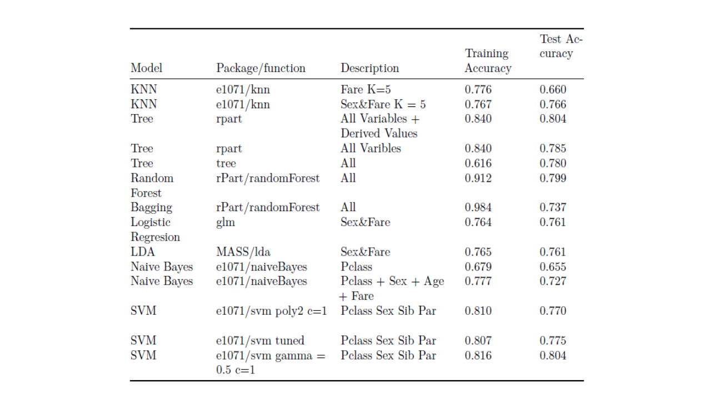
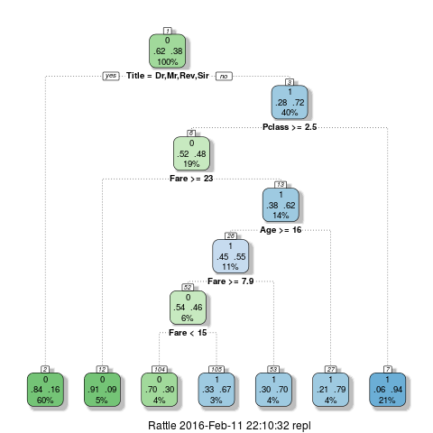

```{r setup, include=FALSE}
knitr::opts_chunk$set(echo = FALSE)
```

## Kaggle Data

- train.csv
  - 891 observations 
  - 11 potential predictor variables
  - Survivor Information

- test.csv
  - 418 observations 
  - 11 potential predictor variables


## Train Data

```{r, message=FALSE, warning=FALSE, include=FALSE}
library(dplyr)
library(VIM) # Data visulazation
library(mice) # Data visulazation
my_dir <- "C:/Docs/Dropbox/PhD/classes/STAT695/Titanic/"
setwd(my_dir)

train <- read.csv("data/train.csv")%>%
  mutate(Survived = factor(Survived),
  Pclass = factor(Pclass),
  Name = as.character(Name),
  Sex = factor(Sex))

test <- read.csv("data/test.csv")%>%
  mutate(Pclass = factor(Pclass),
  Name = as.character(Name),
  Sex = factor(Sex))
```

```{r, message=FALSE, warning=FALSE}
aggr_plot <- aggr(train, col=c('navyblue','red'), numbers=TRUE, sortVars=TRUE,
                  labels=names(data), cex.axis=.7, gap=3, 
                  ylab=c("Histogram of Train missing data","Pattern"))
```

## Test Data
```{r, message=FALSE, warning=FALSE}
aggr_plot <- aggr(test, col=c('navyblue','red'), numbers=TRUE, sortVars=TRUE,
                  labels=names(data), cex.axis=.7, gap=3, 
                  ylab=c("Histogram of Test missing data","Pattern"))
```

## Results




## Winning Tree with Title



